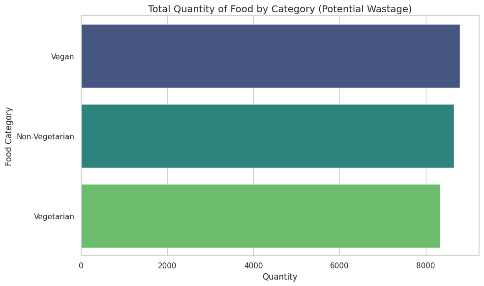
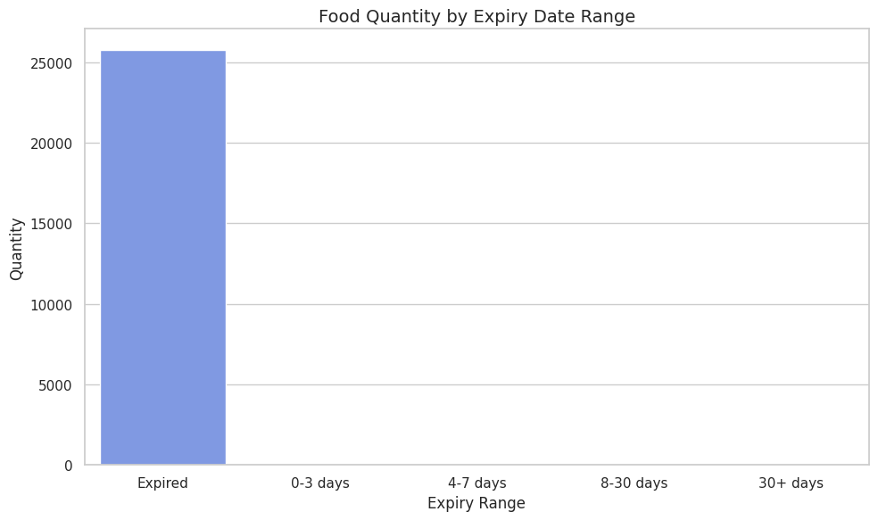
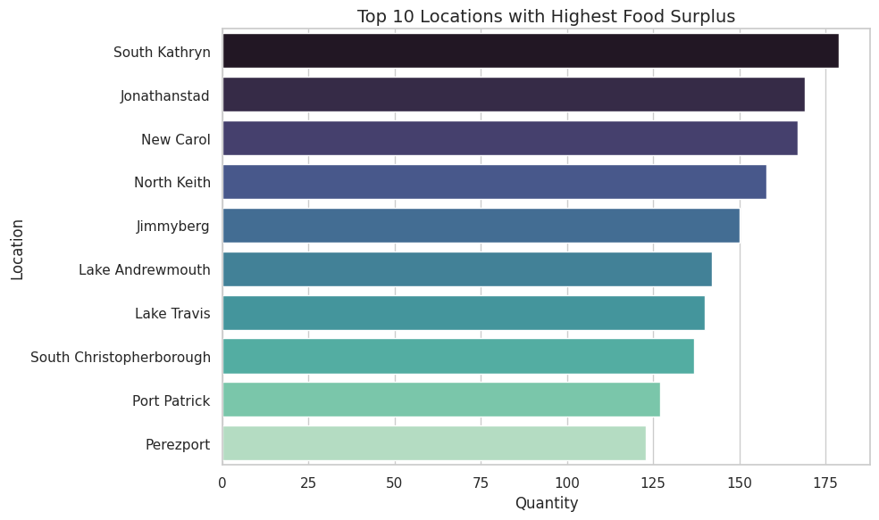

# 🍽️Local Food Wastage Management System

A comprehensive data-driven application designed to tackle food waste through efficient management and analysis of food donation and redistribution networks. This system bridges the gap between food providers (restaurants, supermarkets, cafeterias) and receivers (NGOs, food banks, shelters), enabling communities to reduce food waste while addressing food insecurity.

## 🎯 Project Overview

The Local Food Wastage Management System provides a complete solution for -

- **📊 Real-time Food Tracking** - Monitor available food listings with expiry dates and quantities.
- **🤝 Stakeholder Management** - Maintain comprehensive databases of providers and receivers.
- **📈 Claims Monitoring** - Track food redistribution patterns and success rates.
- **🔍 Wastage Analysis** - Identify trends and bottlenecks in the food redistribution chain.
- **📋 Data-Driven Insights** - Generate actionable reports for better resource allocation.
- **🖥️ Interactive Dashboard** - User-friendly Streamlit interface for stakeholders.

### Key Features

- **Multi-dataset Integration** - Seamlessly handles provider, receiver, listings and claims data.
- **SQLite Database** - Lightweight, portable database solution for efficient querying.
- **Advanced Analytics** - SQL-powered analysis with comprehensive statistical insights.
- **Rich Visualizations** - Interactive charts and graphs using Matplotlib and Seaborn.
- **Real-time Dashboard** - Streamlit-powered web interface for live data exploration.
- **Data Quality Assurance** - Built-in data cleaning and validation processes.

## 🎨 Interactive Dashboard Features

1. **📊 Overview Metrics**
   - Total active providers and receivers.
   - Available food listings count.
   - Total claims processed.
   - Current waste percentage.

2. **🔍 Search & Filter Interface**
   - Filter by food type, location, expiry date.
   - Search providers and receivers.
   - Real-time data updates.

### Quick Glance

<p align="center">
  <br>
  <br>
  <br>
  <br>
  <br>
  
</p>

## 📊 System Architecture

```
┌─────────────────┐    ┌─────────────────┐    ┌─────────────────┐
│   Data Sources  │────│  Data Pipeline  │────│   SQLite DB     │
│  (CSV Files)    │    │  (Pandas/SQL)   │    │  (Structured)   │
└─────────────────┘    └─────────────────┘    └─────────────────┘
         │                       │                       │
         └───────────────────────┼───────────────────────┘
                                 │
                    ┌─────────────────┐
                    │   Analysis &    │
                    │  Visualization  │
                    │ (Matplotlib/    │
                    │   Seaborn)      │
                    └─────────────────┘
                                 │
                    ┌─────────────────┐
                    │   Interactive   │
                    │   Dashboard     │
                    │  (Streamlit)    │
                    └─────────────────┘
```

## 📂 Dataset Structure

The system operates on four interconnected datasets that form the backbone of the food redistribution network -

### 🏪 Providers Dataset (`Providers.csv`)
Organizations and individuals offering surplus food donations.

| Column | Data Type | 
|--------|-----------|
| `Provider_ID` | Integer | 
| `Name` | String | 
| `Type` | String | 
| `Address` | String | 
| `City` | String | 
| `Contact` | String | 

### 🏛️ Receivers Dataset (`Receivers.csv`)
Organizations receiving and distributing surplus food to communities in need.

| Column | Data Type | 
|--------|-----------|
| `Receiver_ID` | Integer | 
| `Name` | String | 
| `Type` | String | 
| `City` | String | 
| `Contact` | String |

### 🍎 Food Listings Dataset (`Food Listings.csv`)
Available surplus food items with detailed specifications.

| Column | Data Type | 
|--------|-----------|
| `Food_ID` | Integer | 
| `Food_Name` | String | 
| `Quantity` | Float | 
| `Expiry_Date` | DateTime | 
| `Provider_ID` | Integer |
| `Provider_Type` | String |
| `Location` | String |
| `Food_Type` | String | 
| `Meal_Type` | String |

### 📝 Claims Dataset (`Claims.csv`)
Records of food items claimed and collected by receivers.

| Column | Data Type |
|--------|-----------|
| `Claim_ID` | Integer | 
| `Food_ID` | Integer | 
| `Receiver_ID` | Integer | 
| `Status` | String |
| `Timestamp` | DateTime |

## 🛠️ Installation & Setup

### Prerequisites

- **Python 3.7+** - Ensure you have Python installed.
- **pip** - Python package manager.
- **Git** - For cloning the repository.

### Environment Setup

1. **Clone the Repository**
```bash
https://github.com/iamhriturajsaha/LOCAL-FOOD-WASTAGE-MANAGEMENT-SYSTEM.git
cd LOCAL-FOOD-WASTAGE-MANAGEMENT-SYSTEM
```

2. **Install Required Dependencies**
```bash
pip install -r requirements.txt
```

### Alternative Quick Install
```bash
pip install pandas sqlalchemy matplotlib seaborn streamlit numpy plotly
```

3. **Launch the Streamlit Dashboard**

```bash
streamlit run app.py
```

## 📋 Detailed Workflow

### 🔄 Data Processing Pipeline

#### 1. **Data Ingestion**
```python
import pandas as pd
from sqlalchemy import create_engine
# Load datasets
providers_df = pd.read_csv('Providers.csv')
receivers_df = pd.read_csv('Receivers.csv')
food_listings_df = pd.read_csv('Food Listings.csv')
claims_df = pd.read_csv('Claims.csv')
```

#### 2. **Data Cleaning & Validation**
```python
# Convert datetime columns
food_listings_df['Expiry_Date'] = pd.to_datetime(
    food_listings_df['Expiry_Date'], 
    errors='coerce'
)
# Remove duplicates
for df_name, df in [('providers', providers_df), ('receivers', receivers_df)]:
    duplicates = df.duplicated().sum()
    print(f"{df_name}: {duplicates} duplicates found")
    df.drop_duplicates(inplace=True)
# Validate data integrity
assert not food_listings_df['Listing_ID'].duplicated().any(), "Duplicate Listing IDs found"
```

#### 3. **Database Creation**
```python
# Create SQLite database
engine = create_engine("sqlite:///Food Wastage.db", echo=False)
# Store datasets as tables
providers_df.to_sql('providers', con=engine, if_exists='replace', index=False)
receivers_df.to_sql('receivers', con=engine, if_exists='replace', index=False)
food_listings_df.to_sql('food_listings', con=engine, if_exists='replace', index=False)
claims_df.to_sql('claims', con=engine, if_exists='replace', index=False)
```

### 📊 Advanced Analytics Queries

#### Top Performing Providers
```sql
SELECT 
    p.Name as Provider_Name,
    COUNT(f.Listing_ID) as Total_Listings,
    SUM(f.Quantity) as Total_Quantity_kg,
    AVG(f.Quantity) as Avg_Quantity_per_Listing
FROM providers p
JOIN food_listings f ON p.Provider_ID = f.Provider_ID
GROUP BY p.Provider_ID, p.Name
ORDER BY Total_Listings DESC
LIMIT 10;
```

#### Food Waste Risk Analysis
```sql
SELECT 
    Food_Type,
    COUNT(*) as Total_Listings,
    SUM(CASE WHEN Status = 'Available' AND Expiry_Date < datetime('now') 
        THEN 1 ELSE 0 END) as Expired_Unclaimed,
    ROUND(
        (SUM(CASE WHEN Status = 'Available' AND Expiry_Date < datetime('now') 
             THEN 1 ELSE 0 END) * 100.0 / COUNT(*)), 2
    ) as Waste_Percentage
FROM food_listings
GROUP BY Food_Type
ORDER BY Waste_Percentage DESC;
```

#### Receiver Efficiency Metrics
```sql
SELECT 
    r.Name as Receiver_Name,
    COUNT(c.Claim_ID) as Total_Claims,
    SUM(c.Quantity_Claimed) as Total_Quantity_Claimed,
    COUNT(CASE WHEN c.Collection_Status = 'Collected' THEN 1 END) as Successful_Collections,
    ROUND(
        (COUNT(CASE WHEN c.Collection_Status = 'Collected' THEN 1 END) * 100.0 / COUNT(c.Claim_ID)), 2
    ) as Success_Rate_Percent
FROM receivers r
JOIN claims c ON r.Receiver_ID = c.Receiver_ID
GROUP BY r.Receiver_ID, r.Name
ORDER BY Success_Rate_Percent DESC;
```

### 📈 Visualization Examples

#### Food Distribution by Category
```python
plt.figure(figsize=(12, 6))
food_counts = food_listings_df['Food_Type'].value_counts()
sns.barplot(x=food_counts.values, y=food_counts.index, palette='viridis')
plt.title('Food Listings Distribution by Category')
plt.xlabel('Number of Listings')
plt.ylabel('Food Category')
plt.show()
```

#### Claims Over Time
```python
claims_df['Claim_Date'] = pd.to_datetime(claims_df['Claim_Timestamp']).dt.date
daily_claims = claims_df.groupby('Claim_Date').size()
plt.figure(figsize=(12, 6))
plt.plot(daily_claims.index, daily_claims.values, marker='o')
plt.title('Daily Food Claims Trend')
plt.xlabel('Date')
plt.ylabel('Number of Claims')
plt.xticks(rotation=45)
plt.grid(True, alpha=0.3)
plt.show()
```

<table>
  <tr>
    <td align="center"></td>
    <td align="center"></td>
  </tr>
</table>
<p align="center">
  
</p>

## 📊 Key Performance Indicators (KPIs)

### System Efficiency Metrics

| Metric | Description | Formula | 
|--------|-------------|---------|
| **Food Recovery Rate** | Percentage of listed food successfully claimed | (Claimed Items / Total Listings) × 100 | 
| **Provider Retention** | Active providers over time | (Active Providers Month N / Month N-1) × 100 | 
| **Waste Reduction** | Percentage of food saved from wastage | (Collected Quantity / Total Listed) × 100 |
| **Response Time** | Average time from listing to claim | AVG(Claim_Time - Posted_Time) | 
| **Collection Success** | Successfully collected vs claimed | (Collected / Claimed) × 100 |

### Business Intelligence Insights

- **Seasonal Patterns** - Identify peak donation and demand periods.
- **Geographic Distribution** - Map of provider/receiver density.
- **Food Category Analysis** - Most/least donated food types.
- **Efficiency Bottlenecks** - Areas for process improvement.
- **Impact Measurement** - Quantify community benefit and environmental impact.

## 🚀 Future Enhancements

- **Real-time Notifications** - Email/SMS alerts for new listings.
- **Mobile App** - React Native companion app.
- **Machine Learning Models** - Predict food waste likelihood.
- **Demand Forecasting** - Predict receiver demand patterns.
- **Cloud Deployment** - AWS/Google Cloud hosting.
- **Multi-language Support** - Localization for global use.
